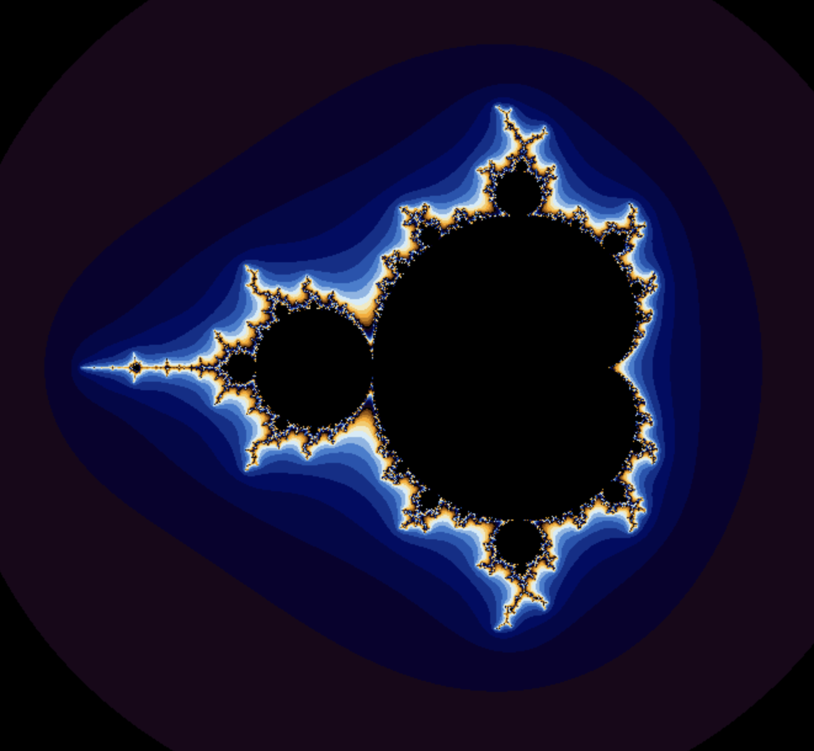
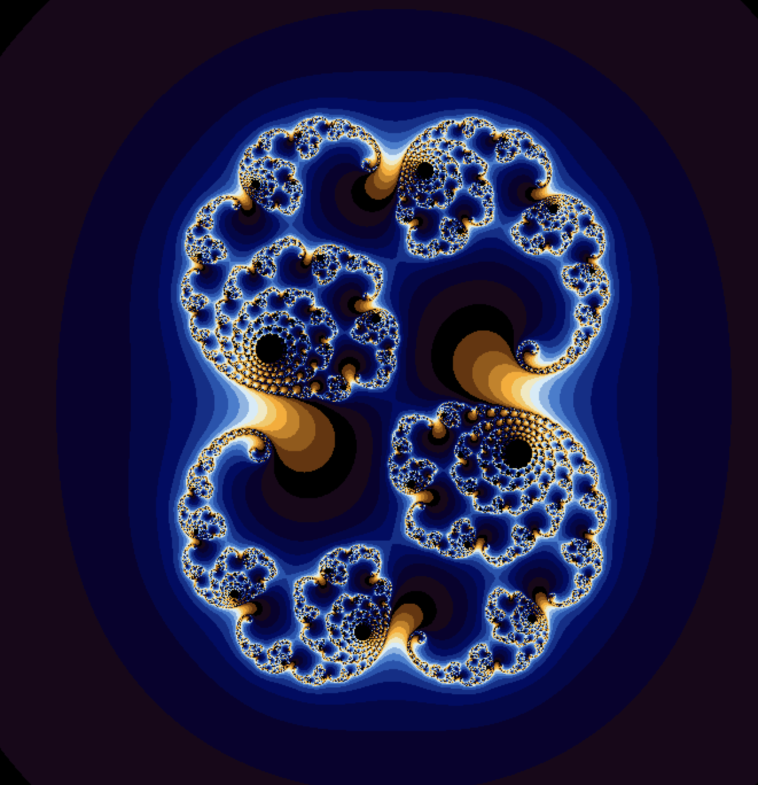

# fractol

The term fractal was first used by mathematician Benoit Mandelbrot in 1974. He based
it on the Latin word fractus which means "broken" or "fractured".
A fractal is an abstract mathematical object, like a curve or a surface, which pattern
remains the same at every scale.
Various natural phenomena – like the romanesco cabbage – have some fractal features.

<h1>Mandelbrot</h1>

<h1>A Julia set</h1>

